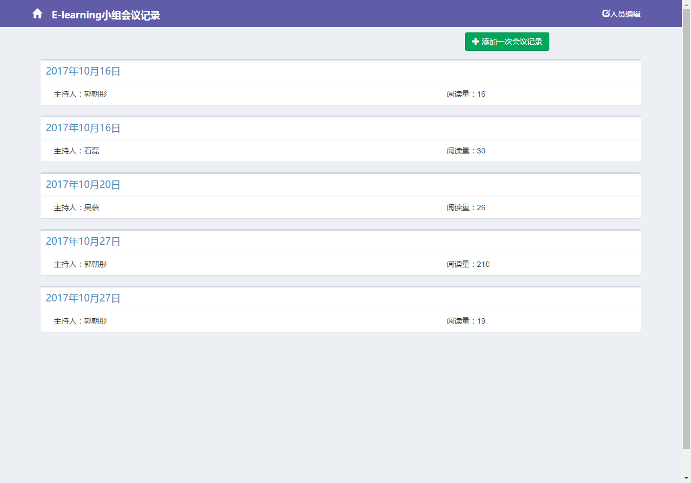
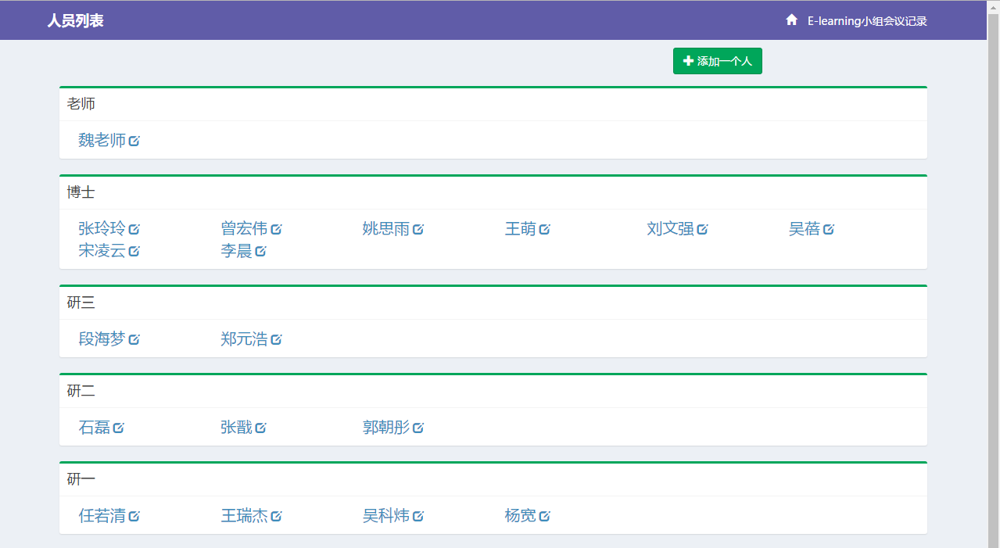
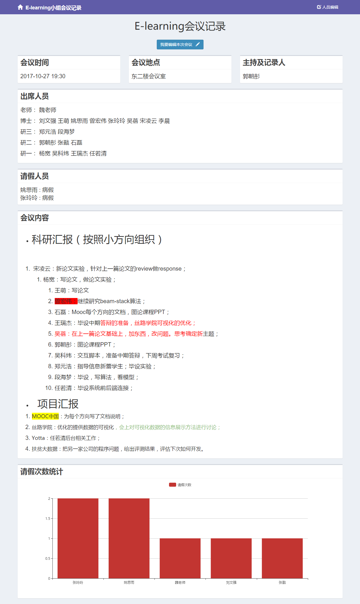
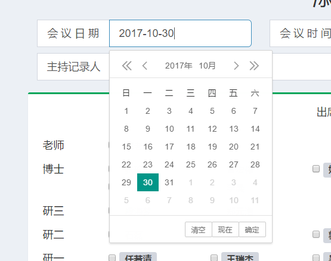
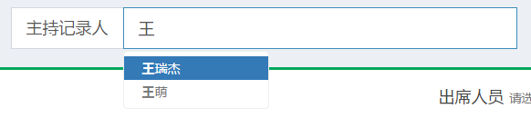
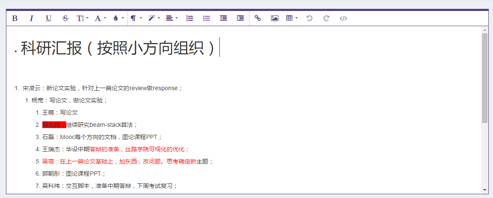
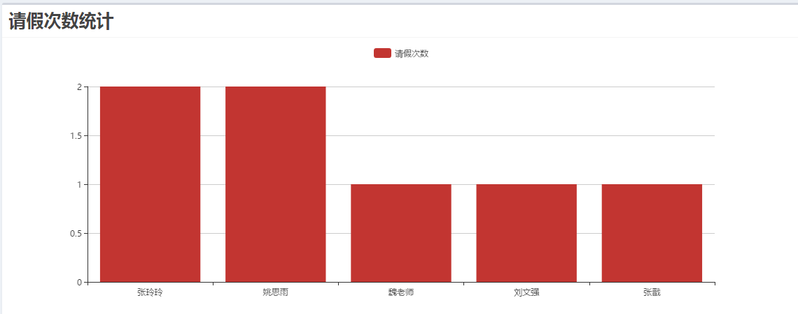

# MeetingRecord
一个记录实验室小组会议记录的网站

## 主要技术 
- spring-boot
- swagger2 ui 测试API
- springboot data jpa（查询，自定义查询）
- 热部署
- 字符串序列化成json
- maven版本管理


## 如何使用和部署
#### 环境准备
1. jdk1.8
1. MySql 5.6及以上
1. TomCat8及以上
1. （可选）安装 Maven，下载解压后设置 bin 目录到 PATH 环境变量中

#### 编译项目
1. 下载源码
2. 解压后按需修改`src/main/resources/application.properties`中的数据库口令配置
```
spring.datasource.username=
spring.datasource.url=
spring.datasource.password=
# springboot上传附件的最大大小，默认1M，可通过下面两句更改大小
spring.http.multipart.maxFileSize=
spring.http.multipart.maxRequestSize=
```
3. 执行 `mvn package` 编译打包，完成后在 target 目录下将生成 ROOT.war
#### 部署
1. 手动新建数据库 meetingrecord
2. 将 war 包部署到 Tomcat/Jetty 的 webapps 目录下，然后启动服务器，注意查看 logs 目录下的日志情况
3. 浏览器访问 http://localhost:8080/
4. 如果把war包改名为 `newName`，就需要在网址后面加上新的名字`/newName`；同时，在前台页面（src -> main -> resources -> static -> js -> config.js中给`appname`赋值为`/newName`）如果不改名，忽略此步骤

#### 更改与细节说明
- 前台页面在src/main/resources/static目录中
- 数据库表会在第一次启动时自动创建
- 上传附件默认在`userhome`+`/会议记录附件/`中


## 主要页面
- 展示所有的会议记录列表

- 添加一次会议记录

- 展示人员列表

- 展示一次会议记录


## 主要插件
- 日历插件 laydate


- 提示框插件 bootstrap typehead


- 文本编辑器插件 froalaEditor

- 图表插件 eCharts


## 特色功能
- 输入框的默认值（如开会日期，默认为编辑那一页的日期）
- 人员必须从提示框选取（记录人和请假人，都必须从提示框中选取，以保证人员存在）
- 复选框的全选和取消全选
- 请假人添加后，列在上方，可实时删除
- 文本编辑器提供各种文本格式
- 查看一次会议，若需要编辑，则编辑框中自动出现原来编辑过的所有内容
- 请假次数统计是截止到开会当天为止的
- 人员列表按照年级分开排列
- 会议记录长度的检测，不能太短！
